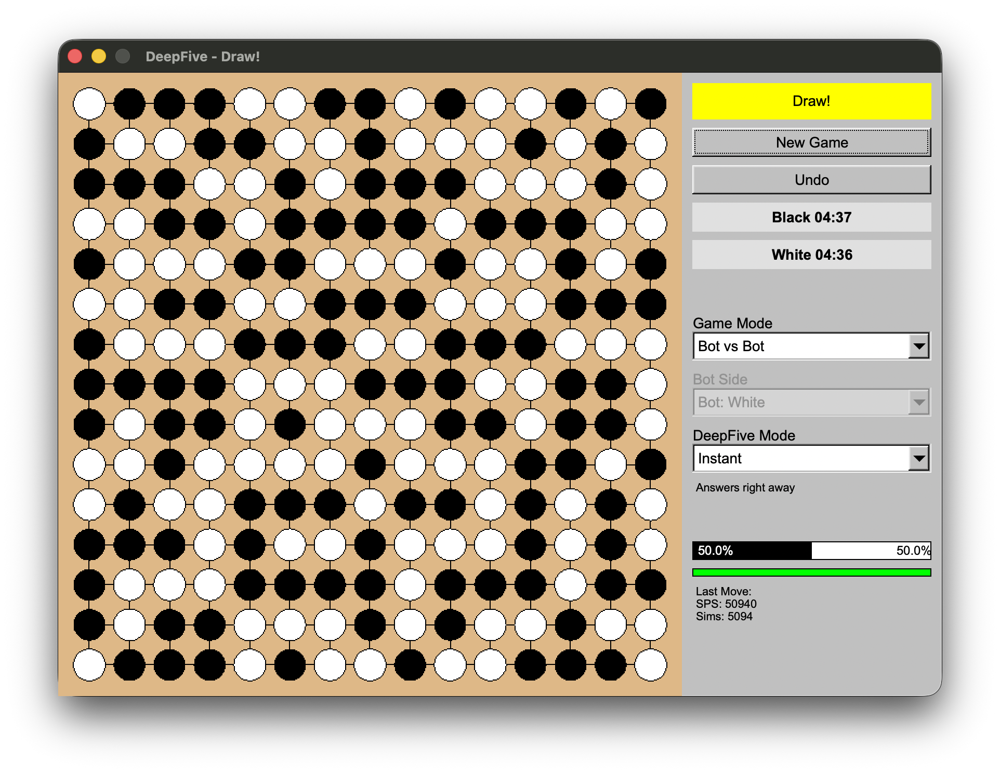

# DeepFive

[](https://en.cppreference.com/w/cpp/17)
[](https://github.com/MacroXie04/DeepFive)
[](https://opensource.org/licenses/MIT)

DeepFive is a modern C++ implementation of Gomoku (Five-in-a-Row) featuring an intelligent bot engine that combines strategic MCTS planning with tactical forced-win detection, all wrapped in Bobcat UI user interface.



> In Bot vs Bot mode, real-time win rate calculation will be paused to save computational overhead.

## Features

### Intelligent AI Engine

**Funnel Decision Model**

DeepFive's AI follows a two-tier decision-making process:

1. **Tactical Layer**: High-priority VCF (Victory by Continuous Four) search using IDDFS
   - Detects forced wins up to 25+ moves ahead
   - Identifies defensive requirements against opponent threats
   - Immediate execution when forced sequences are found

2. **Strategic Layer**: Monte Carlo Tree Search with UCT
   - Explores game tree probabilistically when no forced sequences exist
   - Uses heuristic-guided random rollouts
   - Balances exploration vs. exploitation with Upper Confidence Bound

**Difficulty Modes**

- **Instant**: Lightning-fast responses (~100ms) for casual play
- **Thinking**: Balanced depth and speed (1-2s), default mode
- **Pro**: Deep analysis (5-10s) for maximum strength
- **Auto**: Dynamic time allocation based on game stage and board complexity

**Search Capabilities**

- Parallel VCF search using both BFS and DFS strategies
- Path reconstruction for forced sequences
- Board pattern recognition and threat detection
- Efficient move ordering and pruning

### Modern User Interface

- **OpenGL Canvas**: Smooth, hardware-accelerated board rendering
- **Interactive Gameplay**: Click-to-place stones with visual feedback
- **Side Panel Analytics**:
  - Current player indicator
  - Win rate estimation
  - MCTS simulation count
  - Search depth and node statistics
  - VCF search status
- **Responsive Design**: Clean, intuitive layout with FLTK widgets
- **Cross-platform**: Runs on macOS and Linux

---

## Prerequisites

Before building DeepFive, ensure you have:

- **C++ Compiler**: GCC 7+, Clang 5+, or MSVC 2017+ with C++17 support
- **Bobcat UI**: Fast Light Toolkit for cross-platform GUI development (Note: Please use the included Bobcat UI library due to custom modifications; the STEAMplug version is not supported)
- **Make**: Build automation tool
- **Docker** (optional): For containerized deployment

---

## Getting Started

### Quick Start

```bash
# Clone the repository
git clone https://github.com/MacroXie04/DeepFive.git
cd DeepFive

# Build the project
make

# Run the game
make run
```

The application will launch in a new window. Click on the board to place your stone, and the AI will respond automatically.

### Docker Deployment

DeepFive includes Docker support with X11 forwarding via Xpra:

```bash
# Build the Docker image
docker build -t deepfive .

# Run the container
docker run -d -p 8964:8964 deepfive

# Connect with Xpra client
xpra attach tcp://localhost:8964
```

**Note**: Install Xpra client on your host machine to view the GUI:
- macOS: `brew install xpra`
- Ubuntu/Debian: `sudo apt-get install xpra`

---

## How to Play

### Game Rules

Gomoku is played on a 15×15 grid. Two players alternate placing stones (black and white) on empty intersections. The first player to form an unbroken line of five stones horizontally, vertically, or diagonally wins the game.

### Controls

- **Left Click**: Place your stone on an empty intersection
- **Game Start**: Human plays as Black (goes first), AI plays as White
- **Auto-response**: AI automatically calculates and plays its move after you

### Understanding the AI

**Side Panel Information**:
- **Current Player**: Whose turn it is (Human/AI)
- **Win Rate**: AI's estimated probability of winning (0-100%)
- **Simulations**: Number of MCTS rollouts performed
- **Search Depth**: Maximum depth explored in the game tree
- **VCF Status**: Whether the AI found a forced win sequence

**Difficulty Selection**:
- Choose your difficulty level before the game starts
- **Instant**: Great for learning and quick games
- **Thinking**: Balanced challenge for most players
- **Pro**: Prepare for a serious match
- **Auto**: Let the AI decide based on game complexity

---

## Architecture & Technical Details

### Project Structure

```
DeepFive/
├── src/
│   ├── core/          # Board representation and game logic
│   │   ├── board.h/cpp       # Board state, move validation, win detection
│   ├── bot/           # AI engine implementation
│   │   ├── bot.h/cpp         # Main bot interface and decision logic
│   │   ├── mcts.h/cpp        # Monte Carlo Tree Search engine
│   │   ├── heuristics.h/cpp  # Evaluation functions and patterns
│   │   └── benchmark.h       # Performance testing utilities
│   ├── search/        # Tactical search algorithms
│   │   ├── ForcedBFS.h/cpp   # Breadth-first VCF solver
│   │   ├── ForcedDFS.h/cpp   # Depth-first VCF solver
│   │   ├── ForcedSearchNode.h/cpp  # Search tree node representation
│   │   └── PathReconstruction.h/cpp # Solution path extraction
│   ├── game/          # Game state management
│   │   └── game.h/cpp        # Game controller and flow
│   ├── ui/            # User interface components
│   │   ├── main_window.h/cpp     # Main application window
│   │   ├── gomoku_canvas.h/cpp   # OpenGL board rendering
│   │   ├── side_panel.h/cpp      # Statistics panel
│   │   └── components.h/cpp      # UI helper components
│   └── main.cpp       # Application entry point
├── bobcat_ui/         # Custom UI component library
│   └── *.h            # FLTK widget wrappers and utilities
├── test/              # Unit and integration tests
│   ├── test_board.cpp        # Board logic tests
│   └── test_bot.cpp          # AI engine tests
├── Makefile           # Build configuration
├── dockerfile         # Docker containerization
└── README.md          # This file
```

### AI Decision Algorithm

```
Bot::getBestMove():
  1. Tactical Check (VCF Solver)
     ├─> Run ForcedBFS to find winning sequences
     ├─> Run ForcedDFS to validate forced win paths
     └─> If found: return first move of winning sequence
  
  2. Strategic Search (MCTS)
     ├─> Initialize search tree from current position
     ├─> For each iteration:
     │   ├─> Selection: UCT tree policy
     │   ├─> Expansion: add promising child nodes
     │   ├─> Simulation: heuristic-guided rollout
     │   └─> Backpropagation: update statistics
     └─> Return move with highest visit count
```

**Key Algorithms**:

- **MCTS**: Upper Confidence Bound applied to Trees (UCT)
- **VCF Search**: Iterative Deepening Depth-First Search (IDDFS)
- **Evaluation**: Pattern matching (five-in-a-row, four-in-a-row, three-in-a-row)
- **Move Ordering**: Heuristic-based prioritization for pruning

---

## Development

### Building from Source

```bash
# Build the main application
make

# The binary will be created at bin/app
./bin/app
```

### Running Tests

```bash
# Build and run test suite
make test

# Run tests in headless mode (requires Xvfb)
make autograde

# Check for memory leaks (requires Valgrind)
make memcheck
```

### Code Quality

```bash
# Check code formatting (dry-run)
make lint

# Auto-format all source files
make format
```

### Cleaning Build Artifacts

```bash
# Remove binaries and object files
make clean
```

### Platform-Specific Notes

**macOS**:
- Uses Clang++ compiler
- OpenGL frameworks linked via `-framework OpenGL`
- Silences deprecated OpenGL warnings with `-DGL_SILENCE_DEPRECATION`

**Linux**:
- Uses G++ compiler
- Links OpenGL via `-lGL -lGLU`
- Requires X11 development headers

---

## Contributing

Contributions are welcome! Here's how you can help:

### Reporting Issues

- Check existing issues before creating a new one
- Provide detailed information: OS, compiler version, error messages
- Include steps to reproduce the problem

### Submitting Pull Requests

1. Fork the repository
2. Create a feature branch: `git checkout -b feature/your-feature-name`
3. Make your changes and ensure tests pass: `make test`
4. Format your code: `make format`
5. Commit with clear, descriptive messages
6. Push to your fork and submit a pull request

### Code Style

- Follow C++17 best practices
- Use clear, descriptive variable and function names
- Add comments for complex algorithms
- Run `make format` before committing to ensure consistent formatting
- Write unit tests for new features


---

## License

This project is licensed under the **MIT License** - see the [LICENSE](LICENSE) file for details.
